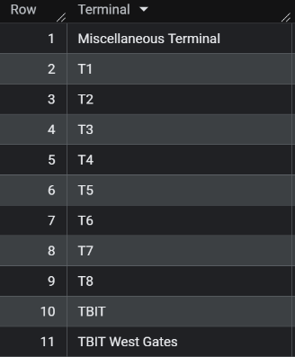

# LAX Vehicle Trips per Passenger: Monitoring Congestion During the Airfield & Terminal Modernization Program

## Overview
This project analyzes vehicle traffic and passenger volume at Los Angeles International Airport (LAX) to build a monitoring framework for curbside and roadway congestion during LAX's ongoing Airfield & Terminal Modernization Program (ATMP).This is designed as a standing KPI, a metric LAWA could track on an ongoing basis to assess whether capital improvement projects are succeeding at reducing per-passenger vehicle congestion as construction progresses.

## Business Task
LAX is in the midst of a roughly $30 billion capital improvement program, including the SkyLink , the Terminal 5 rebuild, Tom Bradley International Terminal modernization, and major roadway reconfiguration (the ATMP Roadway Improvements Project). These projects are intended to reduce congestion and improve passenger access over the long term, but construction itself can temporarily disrupt traffic patterns, displace curbside activity, and shift how passengers and vehicles move through the airport in the near term.

This analysis addresses the following question:

> **How have passenger volume and ground vehicle traffic changed relative to one another during LAX's active construction period, and can a normalized metric (vehicle trips per passenger) meaningfully track congestion pressure over time?**


## Context: LAX's Capital Improvement Program
Key components of the ATMP relevant to this analysis:
- **SkyLink:** an elevated automated people mover connecting terminals, parking, and the Metro rail system; entered passenger-free testing in April 2026
- **Terminal 5 rebuild:** The terminal was shut down on Oct 28, 2025 for demolition and reconstruction, targeted for completion in late 2027
- **Tom Bradley International Terminal modernization:** construction began January 2026
- **ATMP Roadway Improvements Project:** Started mid 2023, the construction of 4.4 miles of replaced and reconfigured roadways to reduce congestion on Sepulveda Boulevard and creation of dedicated airport roadways for airport traffic queues headed to LAX’s Central Terminal Area (CTA).

## Data Sources
- **Passenger Traffic By Terminal:** monthly passenger counts by terminal, arrival/departure, and domestic/international status. Sourced from LA's Open Data Portal (2006–Oct 2023) and LAWA's monthly "Passenger Traffic Comparison by Terminal" PDF reports (Nov 2023–present).
- **Ground Transportation Monthly Report:** monthly vehicle trip counts by operator category, sourced from LAWA's Ground Transportation Statistics PDF archive.
- **Time period covered:** June 2022 – present

## Tools Used
- **Google BigQuery (SQL)** 
- **Python** 
- **Tableau Public**


# Process

## Data Collection

### Passenger Traffic by Terminal Data
1. Exported Passenger Traffic by Terminal as a csv from [data.lacity.org](https://data.lacity.org/Transportation/Los-Angeles-International-Airport-Passenger-Traffi/g3qu-7q2u/about_data).
2. Removed rows 671 and below to narrow the scope to June 2022 - June 2026.
3. Exported individual pdf files for LAX Passenger Traffic Comparison by Terminal from [lawa.org](https://www.lawa.org/lawa-investor-relations/statistics-for-lax/volume-of-air-traffic) (December 2023 - June 2026). It is worth noting that the data for March 2026 was not publicly available, and therefore was not included in this analysis.
4. Used this [script](./scripts/extract_lax_passenger_pdf.py) to convert the pdfs into csv files with the same format as the one retrieved in step 1.
5. Uploaded all the csv files as tables in BigQuery and combined them with a [wildcard query](./scripts/combinetables.sql).
 ```sql
   CREATE TABLE `LAX_data.passenger_combined` AS
  SELECT * FROM `LAX_data.pt*`;
  ```

### Ground Transportation Traffic Data

1. Exported individual monthly pdf files (June 2022 - June 2026) for ground transportation traffic data from [lawa.org](https://www.lawa.org/lawa-investor-relations/statistics-for-lax/ground-transportation-traffic-statistics).
2. Used this [script](.scripts/extract_gt_pdf.py) to convert pdfs into a csv and combine them.
3. Uploaded the csv file as a table in BigQuery.

## Data Cleaning (Passenger Traffic Data)

### Checking for Null Values

When Inspecting the combined table, large chunks of fully null rows were found. Likely due to tailing whitespace in the individual tables before combining. The exact number of fully null rows was queried.

```sql
SELECT COUNT(*) AS fully_null_rows
FROM `LAX_data.passenger_combined`
WHERE DataExtractDate IS NULL
  AND ReportPeriod IS NULL
  AND Terminal IS NULL
  AND Arrival_Departure IS NULL
  AND Domestic_International IS NULL
  AND Passenger_Count IS NULL;
```

**Output:**


Inspecting the table that was sourced directly as a csv in step 1 of the data collection phase revealed that it had 7883 rows. In fact, looking at the tail end revealed pages of fully null rows. Subtracting 7214 from 7883 gives 669, the correct number of data filled rows that should be in that file.

### Removing Fully Null Rows

With the justification above, removed all 7214 fully null rows.

```sql
DELETE FROM `LAX_data.passenger_combined`
WHERE DataExtractDate IS NULL
  AND ReportPeriod IS NULL
  AND Terminal IS NULL
  AND Arrival_Departure IS NULL
  AND Domestic_International IS NULL
  AND Passenger_Count IS NULL;
```

### Checking Distinct Values in Categorical Columns

```sql
SELECT DISTINCT Terminal FROM `LAX_data.passenger_combined` ORDER BY Terminal;
SELECT DISTINCT Arrival_Departure FROM `LAX_data.passenger_combined` ORDER BY Arrival_Departure;
SELECT DISTINCT Domestic_International FROM `LAX_data.passenger_combined` ORDER BY Domestic_International;
```

**Output:** 

  

Verified that all categorical columns have correctly labeled distinct entries.


### Checking for Duplicate Rows

```sql
SELECT ReportPeriod, Terminal, Arrival_Departure, Domestic_International, COUNT(*) AS occurrences
FROM `LAX_data.passenger_combined`
GROUP BY ReportPeriod, Terminal, Arrival_Departure, Domestic_International
HAVING COUNT(*) > 1;
```

**Output:** No data was returned, confirming the absence of duplicate rows

## Data Cleaning (Transportation Traffic)

### Checking for Null Values

Verified that there were neither any completely null rows or columns with null entries

```sql
SELECT COUNT(*) AS fully_null_rows
FROM `LAX_data.gt_traffic_combined`
WHERE ReportPeriod IS NULL
  AND OperatorType IS NULL
  AND Monthly_Trips IS NULL;

SELECT
  COUNTIF(ReportPeriod IS NULL) AS null_report_period,
  COUNTIF(OperatorType IS NULL) AS null_operator_type,
  COUNTIF(Monthly_Trips IS NULL) AS null_monthly_trips
FROM `LAX_data.gt_traffic_combined`;
```

**Output:** 

 

### Checking for Duplicate Rows


```sql
SELECT ReportPeriod, OperatorType, COUNT(*) AS occurrences
FROM `LAX_data.gt_traffic_combined`
GROUP BY ReportPeriod, OperatorType
HAVING COUNT(*) > 1;
```

**Output:** No data was returned, verifying that there were no duplicate rows

### Checking Distinct Values in `OperatorType`

```sql
SELECT DISTINCT OperatorType
FROM `LAX_data.gt_traffic_combined`
ORDER BY OperatorType;
```

**Output:** Returned all 18 operator types, confirming there are no extra or misspelled types

### Checking Distinct Months

Confirmed there are exactly 49 distinct months, with no gaps or duplicates

```sql
SELECT COUNT(DISTINCT ReportPeriod) AS distinct_months,
       MIN(ReportPeriod) AS earliest,
       MAX(ReportPeriod) AS latest
FROM `LAX_data.gt_traffic_combined`;
```

**Output:** 
